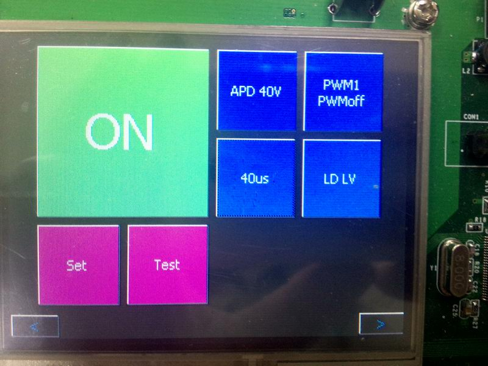
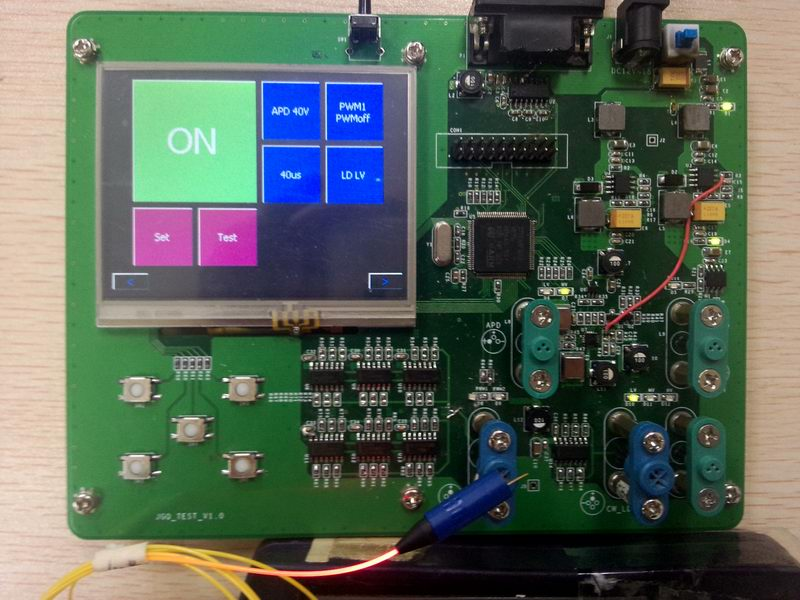
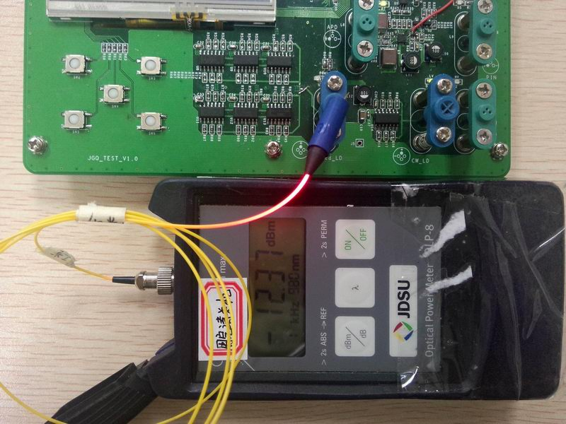

# uTLaser激光器件测试平台

* author MenglongWu
* date 2014-07-02

##用途

**内部使用测试平台**

* 用于测试直流、脉冲激光器功率指标。
* 测试APD、PIN激光探测器

特性

* 拥有APD雪崩电压调节20V、40V
* PWM多通道选择
* PWM反转控制
* PWM脉冲宽度可调，最小脉宽27ns，通常使用10us~40us量程，脉冲周期1ms
* 直流功率三级可调LV、MV、HV
* 采用uCGUI仿WP界面

# 主界面

# 650红光激光器直流功率测试

# 历史版本
- V1.0.0-bate
  简单的调试界面
  - 电源开关
  - APD电压切换
  - PWM通道选择
  - PWM反转
  - PWM脉宽选择
  - 连续光功率选择

- V1.0.1-bate
  - 去除PWM反转
  - LCD触屏校准界面
  - LCD触屏精度测试界面
  - 仿WP界面桌面
  - 弥补防WP界面不能滑动的缺陷，添加两个桌面移动按钮

- V1.0.2-bate
  - 关键：优化SSD1963在ucgui的驱动层（但存在一些bug，不过不影响，后期继续维护）
  - 添加小黄人动态Logo